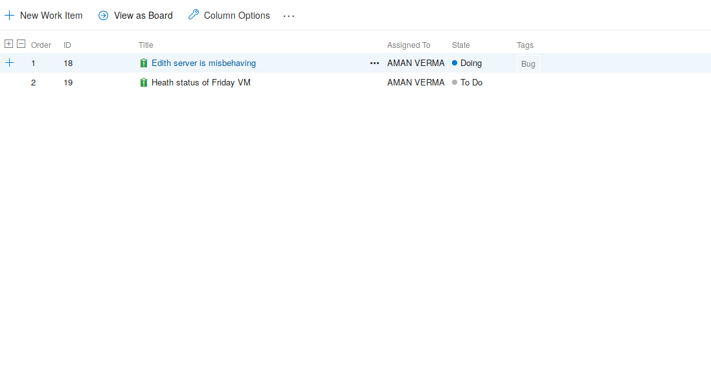

---

title: Azure Boards: The Product Manager
date: "2019-07-07T20:26:33.962Z"
---

# Azure Boards

Azure Boards are used to track your work. It helps you to maintain backlogs and create reports also.

## Why Azure Boards ?

Many software development companies uses Agile software development methodlogies as they are very efficient when it comes to building softwares. So Azure Boards implements it with an online approach. It provides an online dashboard which helps your team from planning sprints, stand-ups to planning meetings. You can customize your dashboards in the way you want which will increase your productivity.

## The core features of Azure Boards
- Work Items
- Boards
- Backlogs
- Sprint
- Queries

At this moment you must be thinking what these terms signifies. So lets go through these terms and understand them with suitable examples.

### Work Items
Work items are the artifacts which helps you to track your work on Azure Boards. You can create tasks require to perform for your softwares and assigned in your team. You can also check the status of your work. Clicking on any of the work item will show you the history of that work item to whom it has been assigned, what is its progress and if somebody commented on it.

### Boards
Each project comes with a Kanban board which helps you to maintain the workflow the project. There are three section 
- To do
    The to-do tasks that your team need to perform for a particular project.
- Doing 
    Includes the list of tasks that are in pipeline.
- Done
    The tasks that are completely successfully. 

You can also customize columns for each team and project. Assign the tasks to an individual developer and you can also add specific tags to each task

### Backlogs
Backlogs helps you to order the priority of tasks. You can simply order the tasks based on their priority with a single drag. Also, you can quickly assign work for an upcoming sprint.

Analyzing the above picture of backlogs of a project its clearly visible that each task has a specific order which can be assigned to anyone. Order of the task can be change depending on its priority.

### Sprints
Sprints helps you to get things done with your team. Each sprint comes with a burnout chart, backlogs and many more features that helps you and your team to deliver work on time.

The above picture shows the sprint1 of a project whose team name is posterpoint. Currently the team has only 2 tasks in the sprint. You can also notice on the right hand side top corner that the current tasks has no iteration date, which off-course is because its a demo. But you can easily set an interation data i.e the starting and the ending date for each task or issue.

### Queries
It's also known as the most powerful feature of Azure Boards. It helps you to find exactly what issue or task you want to track or monitor.

Getting started with Azure Boards is a simple and easy task. You can go on [Azure Devops Portal](https://dev.azure.com) and can start using it by simply making an account depending on your subscription. Companies like Apple, Microsoft and Google follow the Agile Software Development methodlogies because its an efficient way to make a software completely successful. You must be thinking at this moment that why there is a need of any Product Manager in a company when you have Azure Board or something similar to it which manages a workflow of the product. Well do some reasearch and answer yourself till then stay tuned.
