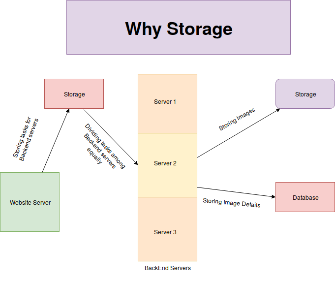
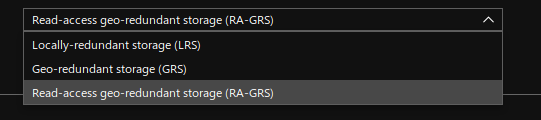
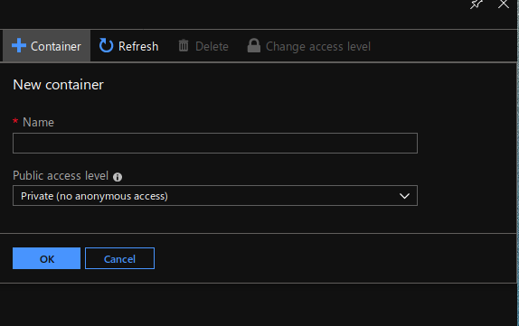
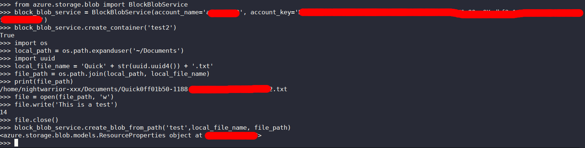
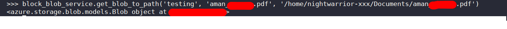
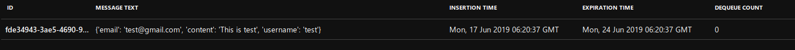
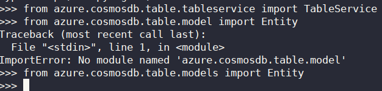
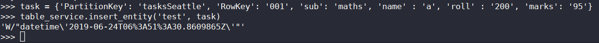

---

title: Azure Storage___A friend who rents his space
date: "2019-06-24T20:26:33.962Z"
---

# Why storage
Suppose you have a image processing website . You don't want your website to function slowly. So you have a backend servers for that. You also don't want your backend server to fail if number of process increases. In order to conquer this you make a storage account that stores processes and then you distribute those all processes equally in backend servers. 
After processing those all data should be now store somewhere so you need a storage for that also. 



Now, first lets understand why the difference between storage and database. It's important to understand the basic difference as developers might use database for storing things which shouldn't be stored there or vice versa.

# Storage VS DataBase

| Storage                   |      Database          |
|---------------------------|------------------------|
|Storage is to store random objects.   |Databases is used to store interrelated data. |
|Considering the above example you will need a storage for storing images you need to process.     |   Again, considering the above example you have to use a database for storing the details of the images.|

I hope the basic difference between storage and database is clear. Let's move on. Now the question arises that what is Azure Storage and why we can use Azure Cloud Storage, even I want to move to Cloud Storage.

# Azure Storage
Azure Storage is a service from Azure which provides storage for various purposes. It is a cloud storage solutions for modern applications be it be scalibility, durability and availability.

Lets discuss the various types of Storage account which you can use for your image processing website.

- General Purpose Storage
    These types of storage account includes the following two divisions:-

    - StorageV1(general purpose V1)
        + When to use Storage V1
            - When you want azure classic demplyment model. Azure do have differrent types of deployment models depending on your subscription.
            - When your applications is transition intensive and uses geo-replication bandwidth you can use Storage V1 account.

        + No zone replication storage (ZRS)
            - When you don't want your data to replicate to some other zone.

    - StorageV2(general purpose V2)
        + It incorporates all features of general purpose V1 and blob storage account(we will study it in sometime.)
        + When you want low per giga byte speed you can go for this.
        + Support Access Tiers
            Access tiers are classified based upon the how frequently you want to use your data. These are classified as below.
            - Hot
                Optimised for data that is stored and accessed frequently.
            - Cold
                Optimised for data that is accessed infrequently and stored for atleast 30 days.
            - Archive
                Optimised for data that is that is hardly accessed and stored for atleast 180 days.

                

- Blob Storage
    + A Binary Large OBject (BLOB) is a collection of binary data stored as a single entity in a database management system. Blobs are typically images, audio or other multimedia objects, though sometimes binary executable code is stored as a blob.


Next comes is an important feature of Azure Storage.

*Replication*
- Zone Redundant Storage (ZRS)

Suppose you have 2 zones (i) Delhi (ii) Kolkata. Your data will be replicated to both the datacentre so that if your one zone gets down your storage account will be up from other zone datacentre.

- Locally Redundant Storage (LRS)

Suppose you have your storage account in a datacentre in Delhi. Now if your server crashes your data will be replicated to Delhi datacentre i.e in which you have actually deployed your storage account.

- Geo Redundant Storage (GRS)

Suppose you have two regions (i) America (ii) India. Both of the regions have number of zones in it. Your data will be replicated to zones of both the regions.

- Read-access-geo-redundant Storage (RA-GRS)

Consider the above scenario where you have two regions America and India. Now if your main server which is in New York (a zone in region America) crashes, you can only read data from India Region.



## Components of Azure Storage
 The following are the components of Azure Storage followed by the hands-on with python3.

## Blob Service
File system service where you can upload any file. Same as S3 in Amazon Web Services.
*Containers* Here containers are same as folder where you store files.

Now suppose you want to storage images after processing images for your image processing website, so can use the following access tiers available in Azure Blob Service.

There are 3 public access levels

- Private
Files can be accessed by only this owner.

- Blob
Files can be accessed by others inside this container.

- Container
If there is a folder inside this container that also can be accessed.



Blob access tier is usually used by the companies as you can use it as an CDN(Content Delivery Network).

**Hands-on**

*Create a container in blob*

```
from azure.storage.blob import BlockBlobService
block_blob_service = BlockBlobService(account_name='<account_name>', account_key='<account_key>')
block_blob_service.create_container('test')
```


*Sending blob in the container*

```
import os
local_path = os.path.expanduser('~/Documents/Resume')
file_name = 'aman'+'.pdf'
file_path = os.path.join(local_path, file_name)
block_blob_service.create_blob_from_path('<container_name>', file_name, file_path)
```



*Downloading blob from container*

```
block_blob_service.get_blob_to_path('<container name>', 'file_name', 'full_path_to_file')
```



## Queue Service
Queue Service is almost same as queue data structure which follows FIFO concept. Suppose we have a image processing website which performs various process. We can store all the processes there and then assign each process to every server.
Suppose you want to store queries send my the users of your image processing website. You can use Queue Service for that.


**Hands-on**
*Send the message to Azure Storage Queue*

- Install the azure storage python library
```
pip install azure-storage
```

- Import the serivces and send the message

```
from azure.storage.queue import QueueService

queue_service = QueueService(account_name='', account_key='')
queue_service.create_queue('test')
queue_service.put_messages('test', '<message>')
```



*Peek message in Azure Storage Queue*

You can peek the message in front of the queue without deleting the message in front of the queue.

```
messages = queue_service.peek_messages('<queue_name>')
for msg in message:
    print(msg.content)
```

*DeQueue Messages from Azure Storage Queue*

Dequeuing the message from the Azure Storage Queue will automatically delete the message from the Queue. Let's have a quick look on it.

```
messages = queue_service.get_messages('<queue_name>')
for msg in messages:
    print(msg.content)
    queue_service.delete_message('<queue_name>', msg.id,msg.pop_receipt)
```


## File System Service 

Almost same as blob service with a small differene that you can treat as an extended drive of your system. To achieve this move to File Service section in Azure Storage account and click on the ```connect``` option on the top. Use the commands with the preference of your system to connect to Azure file system which will appear on the right hand side of your screen.


## Tables Service

Azure table storage service stores a large amount of structured data. This service is a NoSql datastore. Azure table is stored is ideal for storing structured, non relational data.

- Install python package for Azure CosmosDB table
```
pip install azure-cosmosdb-table
```

- import table service and entity class

```
from azure.cosmosdb.table.tableservice import TableService
from azure.cosmosdb.table.model import Entity
```



The entity object can be of type Entity. Every entity must include PartitionKey and RowKey properties.These are the unique itentifiers of your entity and together they form a primary key.
Entities having same PartitionKey are stored on the same node. RowKey are used as an unique identifiers within a partition. 

Now, add the entity object with insert_entity method.


In this way you can simple use the Azure Cosmosdb.

Learning how to use Azure is a complicated task as Azure is bringing new stuff every day. So you need to keep yourself updated to move with Azure.
