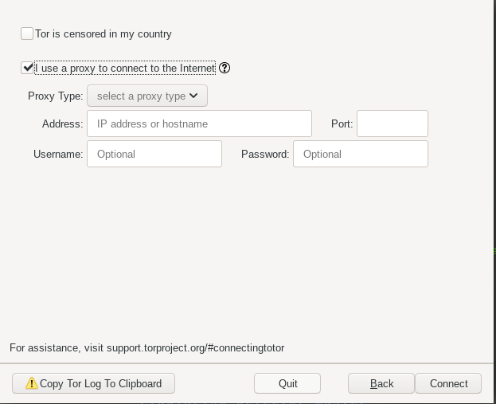
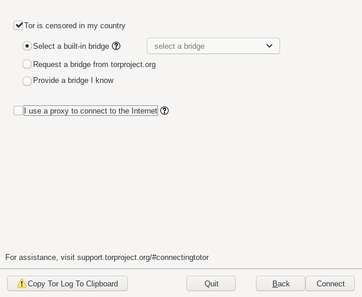

---

title: Connecting to Tor 
date: "2019-05-25T17:12:33.962Z"
---

Tor is a web browser for anonymous browsing, accessing dark web and much more.

## Bridging in Tor
Bridges are also known as *Tor relays*. Since there is no complete public list of Tor bridges the number of bridges that Tor runs are uncountable. That means if your ISP is tracking you and trying to filter your connections, he can't block all the Tor relays. In case if you are blocked from getting connected to Tor network, this is where Tor bridges comes into play. Tor bridges not only helps you to connect to Tor network but it keeps your privacy safe and secure. Do try connecting to Tor network without using bridges in case it worked then it's well and good.

Over the last few years ISPs have found ways of blocking client from connecting to Tor network. They have detectors which stops the flow of traffic when they detect Tor traffic. To conquer this problem Tor has introduced a concept of **pluggable transport** which manipulates the traffic between client and first hop of Tor relay thus nullfying the chances of blocking you from Tor network.
Bridges with pluggable transports can be easily use to browse Tor. Tor provides various default bridges to connect to Tor network in case your country has censored Tor. Shoot Tor and you will se these options before connection to Tor network.

Select *Configure* option for manually configure your bridge setting. You will notice two options *Tor is sensored in my country* and *I use proxy to connect to internet*.

Choose among these two options to connect to Tor network. If you use proxy to connect to the internet choose second option.

Select the *Port type*, set *Address* and choose the *port*. Optionally, set a username and password to connect to Tor network.
If Tor is censored in your country choose the first option *Tor is censored in my country* to select the bridge for connecting.

Tor currently have some deployed pluggable transports some of which are *obfs4*,*meek-azure* and *obfs3*.

- *obfs4*

Built in *GO* and maintained by *Yawning Angel*, *obfs4* utilises Dan Bernstein's elligator2 technique for public key obfuscation and the ntor protocol for one-way authentication. This provides more faster protocol.

- *meek-azure*

It uses Http for carrying bytes and TLS for obfuscation. It also uses a trick to talk to third party which looks like talking to an unblocked server. Built in *GO* and is maintained by *David Fifield*.

Besides these there are several other PL whose details can be found [here](https://2019.www.torproject.org/docs/pluggable-transports.html.en). Tor also provides a request method for bridge where client can request for a bridge.

Another option that Tor provides so that client can connect to the Tor network is *Providing a bridge that I know*. A client can manually add a bridge to connect to Tor network. But make sure to add a bridge that you trust. Clients can get these bridges from
[Tor Bridge](https://bridges.torproject.org/options) where Tor has provide another facility of obtaining bridges. Select the type of bridge you want, verify captca and Tor will provide you a bridge which you can use to connect to Tor network.
Tor is open source and provide these pluggable transport to achieve anonymous communication for free. 
